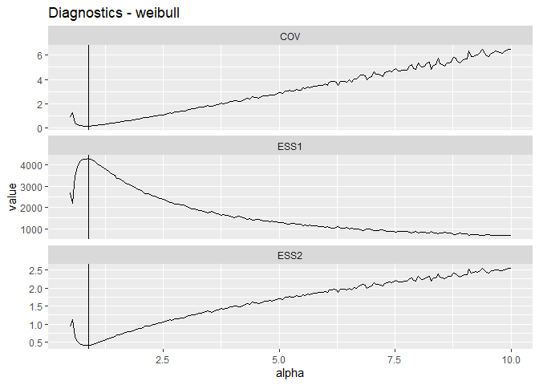
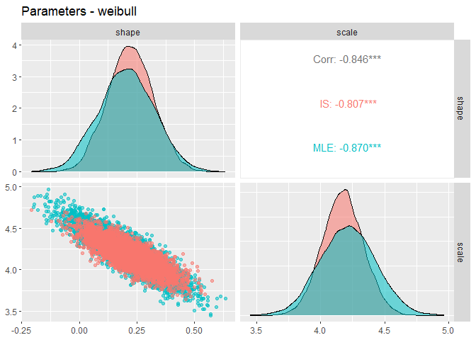
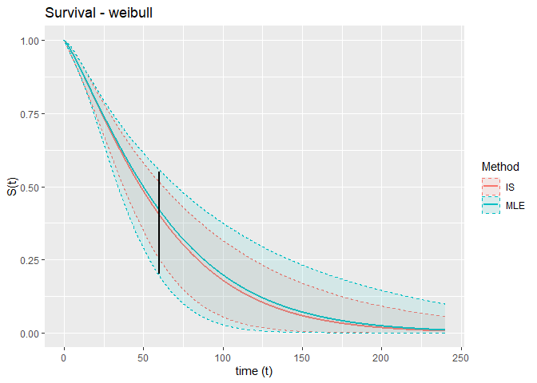
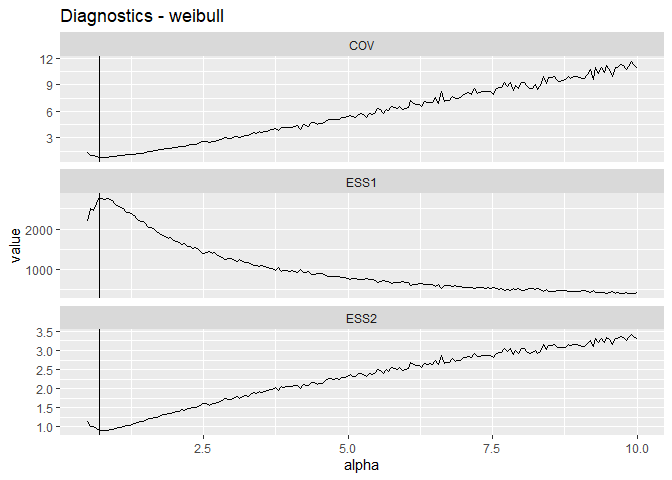
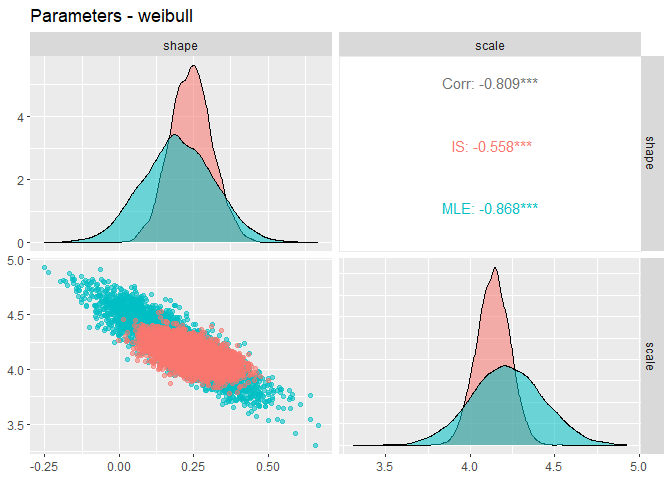
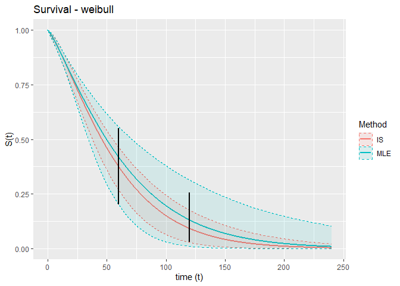

Survival Extrapolation Incorporating External Information Using
Importance Sampling
================
NCPE
2024-05-10

## Basic Usage

## Required input data

### Fitted parametric curves

The starting point for this method is fitted parametric survival curves,
using one of the six ‘standard’ parametric distributions. Specifically
we require (i) parameter estimates and (ii) the associated covariance
matrix. If individual survival times are available, then these can be
obtained by fitting the required distributions using the ‘flexsurv’
package or similar; but in general, we assume that this is not the case
and that only the summary information (i) and (ii) is available to the
user (e.g. these could be extracted from an Excel model provided by a
third party).

For this example we have provided the object ‘mle.params.RDS’ which
contains a list with summary parmeter estimates and covariance matrices
for the six standard parametric survival models fit to data from the
KEYNOTE-XXX study, shown in the figure below.


``` r
mle.params<-readRDS("mle.params.RDS")
# Named list of summary survival parameters from flexsurv outputs
names(mle.params)
```

    ## [1] "exponential" "weibull"     "gompertz"    "lognormal"   "llogis"     
    ## [6] "gengamma"

``` r
# Weibull parameters for example
mle.params[["weibull"]]
```

    ## $coeff
    ##     shape     scale 
    ## 0.2028128 4.2127617 
    ## 
    ## $cov
    ##             shape       scale
    ## shape  0.01478438 -0.02285255
    ## scale -0.02285255  0.04662132

Note that these parameters are presented on the default (transformed)
scale used by flexsurv, i.e., correspond to the `$coefficients` and
`$cov` attributes of a fitted flexsurvreg object. If the model has been
fit using different software then it may be necessary to transform the
parameters.

In this example we will focus on the Weibull so we extract the required
parameters.

``` r
weib.coeff<-mle.params[["weibull"]][["coeff"]]
weib.cov<-mle.params[["weibull"]][["cov"]]
```

### External information on expected survival at a future timepoint

The second input required by the model is information on expected
survival at one or more future timepoints, formulated as a probability
distribution. In our case, we expect (with 95% probability) that 5-year
overall survival for the cohort will lie withing the range of 20% to
55%. For simplicity, we specify a normal distribution with central 95%
density contained within the region 0.20 to 0.55.

``` r
# This is the time point at which the prior for survival is to be specified.
tstar<-60 # measured in months in this example

## Upper and lower limits of expected 5-year survival
lower_prob <- 0.20
upper_prob <- 0.55
mu_t <- (lower_prob+upper_prob)/2

## Further we assume estimate is normally distributed with 95% confidence between limits
sigma_t <- (upper_prob - mu_t) / (1.96)
```

The variables `tstar`, `mu_t` and `sigma_t` fully encode our external
information in this case.

## Use of the method to obtained adjusted survival predictions

All of the required code is included in `functions.R`; . From a user’s
point of view, the important one is `expert_surv`, which takes the
original fitted curves and external information as input, implements the
importance sampling algorithm, and returns the parameters and covariance
matrix of the ‘adjusted’ survival curves as output.

The syntax is:

``` r
is_surv(
    coeff, #vector of parameter estimates (same format and scale as flexsurvreg object)
    cov, # covariance matrix (same format and scale as flexsurvreg object)
    dist, # Distribution: one of ("exponential","weibull","gompertz","lognormal","llogis","gengamma")
    ex_info # Loss function/prior: see below
    )
```

Before using `is_surv` we need to specify `ex_info` in the correct
format. This should be a named list containing:

- `tstar` numeric specifying the timepoint(s) at which external
  information is to be used

- `loss` the log-density function(s) encoding the external information.

  - For a single timepoint this should be specified as
    e.g. `loss=function(x)...`

  - For multiple timepoints, this should be the *sum* of the log-density
    functions for each point, specified as a function of one vector
    argument `x`, where `x[1],x[2],x[3],...` are the survival
    predictions for the timepoints `tstar[1],tstar[2],tstar[3],...`

- `lower_probs` and `upper_probs`: vectors of lower and upper limits of
  confidence intervals of the density functions (only required for
  plotting)

In our example, we specify the external information as follows:

``` r
# External Information
ex.info<-list("tstar"=tstar,
                  "loss"=function(x){dnorm(x,mean=mu_t,sd=sigma_t,log=TRUE)},
                  "lower.probs"=lower_prob,
                  "upper.probs"=upper_prob
                )
```

Then we can implement importance sampling and obtain the adjusted
curves:

``` r
fit<-is_surv(
      coeff=weib.coeff,
      cov=weib.cov,
      dist="weibull",
      ex_info=ex.info
      )
```

    ## Choosing alpha...
    ## fitting restricted model ...
    ## Done.

The output of `is_surv`contains the following:

- `post_mean`: parameter estimates for the adjusted survival curves

- `post_cov`: covariance matrix for the parameter estimates of the
  adjusted survival curves

- `par_new`: 5000 parameter samples drawn from the ‘posterior’
  multivariate normal distribution defined by `post_mean`and `post_cov`

- `orig`: original parameter estimates and covariance matrix (list)

- `ex_info`: external information used to fit the model

- `alpha_star,  iter_star,  ESS_mat,  alpha_vec` : importance samping
  diagnostics

Now, the adjusted parameter estimates can be extracted and used (for
example) in an existing cost-effectiveness model:

``` r
fit$post_mean
```

    ##     shape     scale 
    ## 0.2196108 4.1746629

``` r
fit$post_cov
```

    ##              shape       scale
    ## shape  0.009386534 -0.01187727
    ## scale -0.011877274  0.02369849

However, it is probably a good idea to examine the output before doing
this. To do this we have provided the function `expert_surv_viz_gg`
which produces three output plots:

1.  Importance sampling diagnostics (see \[ref\] for interpretation of
    these)

2.  Plots of parameter estimates both with and without adjustment to
    incorporate external information

3.  Plots of survival curves both with and without adjustment to
    incorporate external information (including confidence intervals
    based on simulations, and confidence intervals of the prior
    distribution)

``` r
is_surv_viz_gg(
  fit, # is_surv object
  times = seq(0, 12*20, len = 1e4),# Grid of timepoints for plotting. Here we want to plot 20 years using a grid of 1e4 points
  #tstar=tstar,
  dist="weibull" # Name of distribution
)
```

<!-- --><!-- --><!-- -->

## Example with 2 timepoints

This time we modify the preceding example to include additional
information on survival at 10 years. Indeed, suppose that specify a
prior distribution for 10-year OS with mean 0.1 and with 95% density
contained in the region bounded above by 0.25. To avoid assigning a
nontrivial prior probability to values below zero, we use a lognormal
distribution.

``` r
# External Information at 10 years
log.se<-(log(0.25)-log(0.1))/(qnorm(0.95))

log.mu<-log(0.1)-log.se^2/2
# Fix this later

# Specification of the prior
ex.info.2<-list("tstar"=c(60,120),
                  "loss"=function(x){dnorm(x[1],mean=mu_t,sd=sigma_t,log=TRUE)+
                      dlnorm(x[2],meanlog=log.mu,sdlog=log.se,log=TRUE)
                      },
                  "lower.probs"=c(0.2,qlnorm(0.025,meanlog=log.mu,sdlog = log.se)),
                  "upper.probs"=c(0.55,qlnorm(0.975,meanlog=log.mu,sdlog = log.se))
                )
```

``` r
fit2<-is_surv(
      coeff=weib.coeff,
      cov=weib.cov,
      dist="weibull",
      ex_info=ex.info.2
      )
```

    ## Choosing alpha...
    ## fitting restricted model ...
    ## Done.

``` r
is_surv_viz_gg(
  fit2, # expert_surv object
  times = seq(0, 12*20, len = 1e4),# Grid of timepoints for plotting. Here we want to plot 20 years using a grid of 1e4 points
  #tstar=tstar,
  dist="weibull" # Name of distribution
)
```

<!-- --><!-- --><!-- -->

## To do list

Make specification of the priors easier
